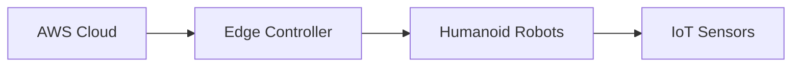
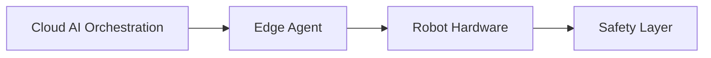

# SigmaCode AI Robotics Pitchdeck

---
marp: true
theme: default
paginate: true
style: |
  :root {
    --color-primary: #0066cc;
    --color-secondary: #00cc99;
    --color-accent: #ff3366;
    --color-background: #ffffff;
    --color-text: #333333;
  }
  h1, h2, h3 { color: var(--color-primary); font-family: 'Inter', sans-serif; }
  section { background-color: var(--color-background); color: var(--color-text); font-family: 'Inter', sans-serif; }
---

## 1. Cover
- **Projektname**: SigmaCode AI Robotics
- **Claim**: The Operating System for Humanoid Robots
- **Logo**: [Placeholder]

---

## 2. Vision/Mission
> "Making humanoid robots accessible to everyone – safe, smart, scalable."

---

## 3. Problem
- **Arbeitskräftemangel** in EU: Bis 2030 fehlen 7,6M Fachkräfte
- **Kostenintensiv**: Ein menschlicher Lagerarbeiter kostet 45.000€/Jahr
- **Regulatorische Unsicherheit**: Kein Rahmenwerk für KI-Roboter-Interaktion

---

## 4. Solution
**Robotics-as-a-Service (RaaS)**:
- **Plug-and-Play** Integration in bestehende Infrastruktur
- **App Store** für Robotik-Anwendungen
- **KI-Agentenplattform** für adaptive Automatisierung


---

## 5. Technology
<!-- Storyline Definition -->
## :triangular_flag_on_post: Narrative Flow
Problem ➔ Solution ➔ Market ➔ Traction ➔ Financials ➔ Ask

---

<!-- Slide 5: Technology -->
## :gear: Technologische Architektur

**Dreischichtiges System:**
1. **Cloud Layer** (AWS IoT Core/SageMaker)
2. **Edge Controller** (Echtzeit-Datenverarbeitung)
3. **Robot Layer** (ROS2-basierte Hardware)



**Sicherheit:**
- End-to-End-Verschlüsselung
- Policy-Engine für Compliance



---

## 6. Market
- **TAM**: €100B+ by 2030 (Service Robotics)
- **SAM**: €50B EU Market
- **SOM**: €5B DACH by 2028

---

## 7. Competition
| Company       | Hardware | Software | Platform |
|---------------|----------|----------|----------|
| Tesla         | ★★★★★    | ★★★☆     | ★☆       |
| Boston Dynamics| ★★★★★    | ★★★☆     | ☆        |
| **SigmaCode** | ★★★☆     | ★★★★★    | ★★★★★    |

---

## 8. Business Model
- **Revenue Streams**:
  1. RaaS Subscriptions
  2. App Store Commissions
  3. Custom Development
  4. White-Label Solutions

---

## 9. Roadmap
```mermaid
gantt
title 2025-2030 Roadmap
section Phase 1
2025 : Prototype, a1, 2025-01, 2025-12
section Phase 2
2026-2027 : Pilots, a2, 2026-01, 2027-12
section Phase 3
2028-2030 : Scale EU, a3, 2028-01, 2030-12
```

---

## 10. Team
- **AI Experts**: 3 PhDs
- **Robotics Engineers**: 5+ years experience
- **Advisors**: Industry veterans

---

## 11. Financials
- **Projected Revenue**:
  - 2027: €1.15M
  - 2030: €28M
- **Break-even**: 2029

---

## 12. Funding Request
| Source       | Amount    | Purpose          |
|--------------|-----------|------------------|
| aws Preseed  | €330k     | Team + Prototype |
| FFG Basis    | €1.5M     | R&D Scaling      |
| Private      | €2M       | Market Entry     |

---

## 13. Risks & Mitigation
1. **Tech Risk**: Parallel testing
2. **Market Risk**: Focus on acute shortages
3. **Regulatory Risk**: Safety-first design

---

## 14. Exit Strategy
- **IPO**: 2030+
- **Acquisition**: Robotics/Cloud players

---

## 15. Impact
- **Social**: Solve labor shortages
- **Economic**: Create high-tech jobs
- **Ecological**: Efficient operations

---

## 16. Summary
- Unique platform approach
- Huge market in EU
- Experienced team

---

## 17. Call to Action
- **Seeking**: €4M total funding
- **Next Milestone**: TRL 6 by 2026

---

## 18. Contact
- Email: contact@sigmacode.ai
- LinkedIn: [SigmaCode AI](https://linkedin.com/company/sigmacode-ai)

---

<!-- Letzte Folie: Kontakt -->
## :email: Kontakt

**Dr. Max Mustermann**
CEO & Gründer

- ✉️ max@example.com
- 🔗 linkedin.com/in/maxmustermann

---

**Anhang**: [FFG/AWS-spezifische Details](./ffg-aws-anhaenge.md)
